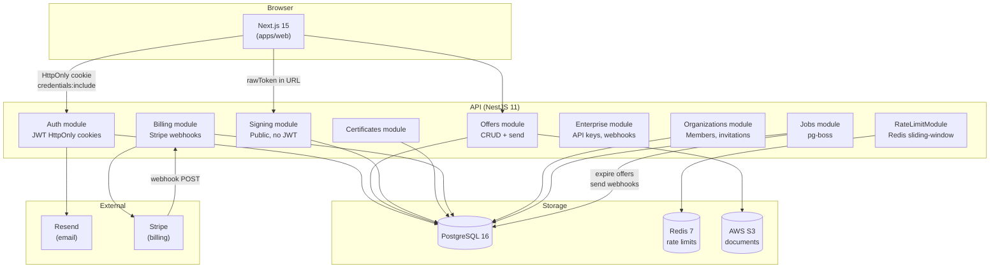
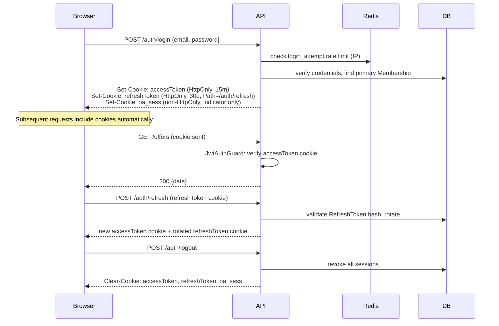
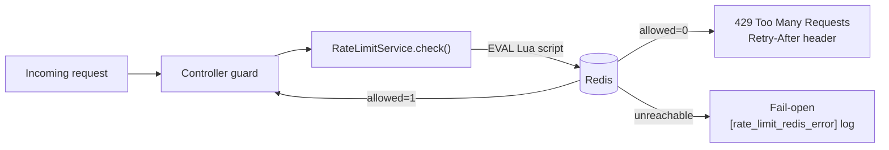
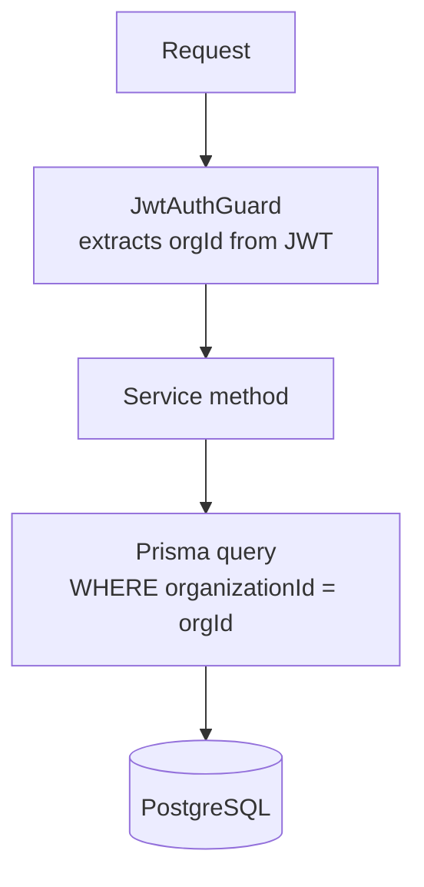
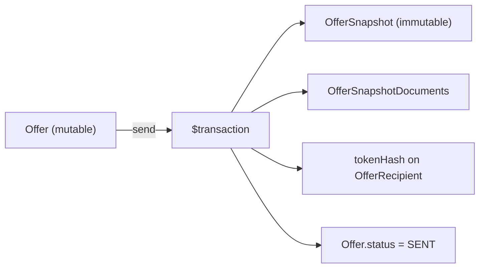
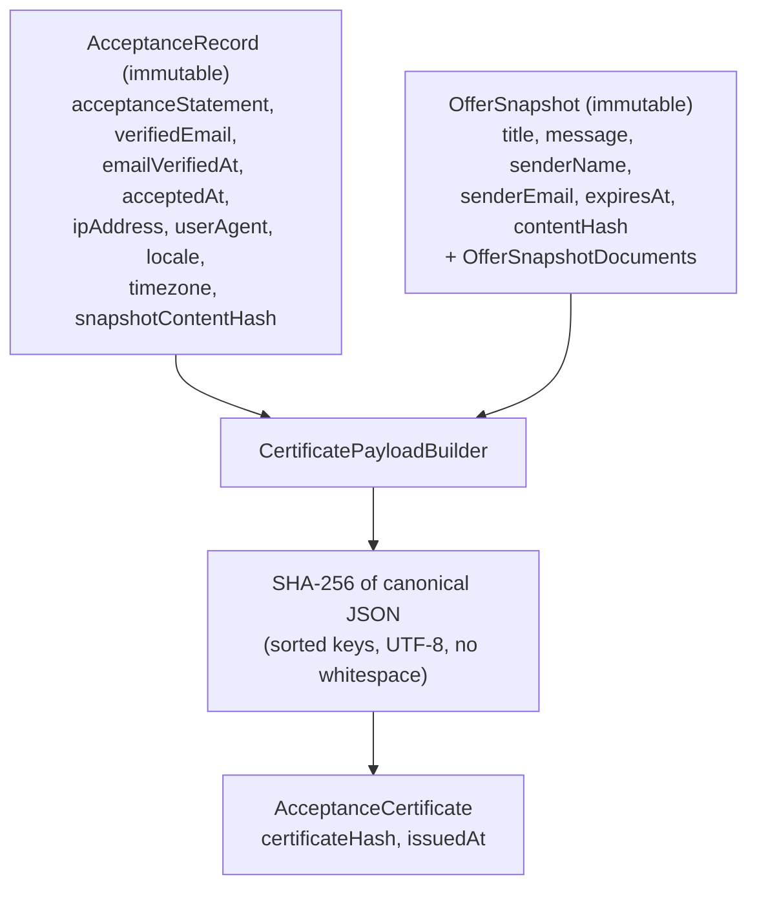
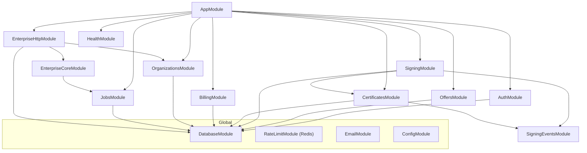

# OfferAccept — Architecture

## What OfferAccept is

OfferAccept makes it easy for a sender to present a commercial offer and for a recipient to
accept it, and to produce a **verifiable, tamper-evident record** that proves what was
accepted, who accepted it, and when. The trust assertion is:

> *The person who controls the recipient's email inbox agreed to the offer as presented.*

This is the same assurance level as a click-to-accept or an email-reply confirmation —
with significantly stronger auditability.

**It is not** a qualified electronic signature (QES) platform under eIDAS, a biometric
identity service, or a contract management system.

---

## System overview



---

## Repository structure

```
offeraccept/
├── apps/
│   ├── api/          NestJS 11 — REST API, business logic
│   └── web/          Next.js 15 — dashboard + public signing flow
├── packages/
│   ├── database/     Prisma 5 schema, migrations, PrismaClient singleton
│   └── types/        Shared TypeScript API contracts (@offeraccept/types)
└── docs/
```

Managed as an npm workspace monorepo with Turborepo 2 for task orchestration.

---

## Bounded contexts

### 1. Identity (`auth`, `organizations`)

Owns: organization creation, user accounts, authentication, role management, invitations.

- `Organization` is the top-level tenant. All offer data is org-scoped.
- `User` has a platform `UserRole` (OWNER / ADMIN / MEMBER / INTERNAL_SUPPORT).
- `Membership` is the canonical org-membership record. A user can belong to multiple orgs.
  The JWT payload reads `orgId` and `orgRole` from the user's **primary Membership**
  (prefers OWNER role, falls back to earliest-created).
- `OrgRole` hierarchy: `OWNER(4) > ADMIN(3) > MEMBER(2) > VIEWER(1)`.
- Auth uses **HttpOnly cookies** (`accessToken` 15 min, `refreshToken` 30 days, rotated).
- Refresh tokens are stored hashed in `RefreshToken` table and rotated on every use.
- Signup creates org + user + membership atomically.

### 2. Offers (`offers`, `offer_documents`, `offer_snapshots`, `offer_snapshot_documents`)

Owns: offer lifecycle and content freezing.

- `Offer` is a mutable operational record (DRAFT → SENT → terminal).
- `OfferDocument` holds file metadata. File bytes live in S3.
- On send: an `OfferSnapshot` is created atomically. After this point the snapshot owns
  the authoritative content — `Offer` fields are never used for signing or certificates.
- v1: one recipient per offer (`OfferRecipient.offerId @unique`).

### 3. Signing (public-facing)

Owns: the recipient's entire journey — token validation, OTP, acceptance, decline.

- All endpoints are **unauthenticated**. The signed URL token is the credential.
- Signing sessions are bound to a specific `OfferSnapshot` at creation.
- Every meaningful action writes an immutable, hash-chained `SigningEvent`.
- OTP verification is required before acceptance.
- Acceptance evidence is captured in an immutable `AcceptanceRecord`.

### 4. Certificates

Owns: generating and verifying `AcceptanceCertificate` from `AcceptanceRecord`.

- Certificate content is derived from `AcceptanceRecord` + `OfferSnapshot` only.
- Mutable entities (`Offer`, `User`, `Organization`) are never read at certificate time.
- `certificateHash` (SHA-256) allows independent third-party integrity verification.

### 5. Billing

Owns: Stripe webhook ingestion, subscription state, plan enforcement.

- `Subscription` is 1:1 with `Organization`. Stripe is authoritative.
- Other modules call `SubscriptionService.canSendOffer(orgId)` — no direct Stripe coupling.

### 6. Enterprise (`api_keys`, `webhook_endpoints`)

Owns: programmatic API access and outgoing webhooks for customer integrations.

- `ApiKey`: stored as SHA-256 hash; raw key shown exactly once at creation.
- `WebhookEndpoint`: HMAC-SHA256 signed delivery; retry via pg-boss; 10 s timeout.

### 7. Jobs (`jobs`)

Owns: background work via **pg-boss** (Postgres-native queue, no Redis required for jobs).

- `expire-offers`: marks SENT offers past their `expiresAt` as EXPIRED.
- `send-webhook-event`: outgoing webhook delivery with exponential back-off.
- `reset-monthly-usage`: resets `monthlyOfferCount` on the first of each month.

---

## Authentication and session model



**Key properties:**
- `accessToken`: HttpOnly, SameSite=Strict, Secure (prod), `Path=/`
- `refreshToken`: HttpOnly, SameSite=Strict, Secure (prod), `Path=/api/v1/auth/refresh`
- The `JwtAuthGuard` accepts `Authorization: Bearer` **or** the cookie — supports both
  browser sessions and API key / programmatic access.
- No tokens are stored in `localStorage`. XSS cannot steal sessions.

---

## Rate limiting

Rate limiting uses a **Redis sorted-set sliding-window** implemented in Lua. One Lua script
atomically prunes expired entries, counts, and conditionally increments — no TOCTOU race.



**All API instances share the same Redis**, so limits are globally consistent across
horizontal scaling. Keys expire automatically after `windowMs + 1s`.

| Profile | Key | Limit | Window |
|---------|-----|-------|--------|
| `login_attempt` | IP | 10 | 15 min |
| `login_attempt_burst` | IP | 3 | 10 s |
| `forgot_password` | IP | 3 | 1 hour |
| `signup_attempt` | IP | 5 | 1 hour |
| `signup_attempt_burst` | IP | 2 | 30 s |
| `token_verification` | IP | 10 | 15 min |
| `otp_issuance` | tokenHash | 3 | 1 hour |
| `otp_verification` | IP | 10 | 15 min |
| `otp_verification_burst` | IP | 3 | 10 s |
| `signing_global` | IP | 60 | 1 min |
| `cert_verify` | IP | 10 | 1 min |
| `invite_attempt` | userId | 10 | 1 hour |
| `invite_accept_attempt` | IP | 5 | 15 min |
| `support_resend_otp` | sessionId | 3 | 5 min |
| `support_resend_link` | actorId | 5 | 10 min |

OTP verification also has a **database-persisted** per-challenge attempt limit (`maxAttempts=5`)
that survives process restarts — unlike the Redis counters.

---

## Multi-tenant isolation



- Every authenticated service method scopes queries to `orgId` from the JWT.
- `OrgRoleGuard` enforces minimum `OrgRole` per endpoint using `@MinOrgRole()` metadata.
- `ApiKeyGuard` resolves `orgId` from the `ApiKey` row — same isolation applies.
- Cross-tenant access is impossible without a valid token for that org.
- `test/offers/tenant-isolation.spec.ts` verifies this at the integration level.

---

## Signing trust model

### Email link + OTP rationale

The email link alone proves *someone* with inbox access opened the link — not that the
intended person was present at acceptance time. Links can be forwarded or pre-loaded by
email security scanners.

The OTP step sends a time-limited code to the same inbox **at the moment of acceptance**,
proving live inbox control. It also creates an independently timestamped audit event
(OTP delivery) separate from the link click.

**Email link = identifies the session. OTP = verifies inbox control at acceptance time.**

### OTP deferred until user action

Email security gateways (Proofpoint, Mimecast, Gmail Safe Browsing) automatically follow
links in incoming emails. If `GET /sign/:token` triggered an OTP, the scanner would
consume the code before the real recipient saw it.

`GET /sign/:token` has **no side effects** — it only reads offer context. The OTP is
issued only via `POST /sign/:token/otp`, which scanners never call.

### Token design

| Property | Detail |
|----------|--------|
| Format | `oa_<base64url(32 random bytes)>` — 256-bit entropy |
| Storage | Only `SHA-256(rawToken)` stored in DB; raw token never persisted |
| Lookup | `WHERE tokenHash = SHA256(incoming) AND tokenExpiresAt > NOW() AND tokenInvalidatedAt IS NULL` |
| Re-use | Token is not single-use; recipient can re-open link on a second device |
| Invalidation | `tokenInvalidatedAt` set on revoke or explicit cancellation |

### OTP design

| Property | Detail |
|----------|--------|
| Code | 6-digit numeric, `crypto.randomInt(100000, 999999)` |
| Storage | Only `SHA-256(code)` stored; raw code delivered by email only |
| TTL | 10 minutes |
| Attempt limit | 5 per challenge (DB-persisted); locked → `OTP_MAX_ATTEMPTS` event |
| Re-issue | New OTP invalidates all prior challenges for the session |

---

## Frozen offer snapshot

When an offer transitions from DRAFT to SENT, an `OfferSnapshot` is created atomically:



After the transaction, the snapshot owns all content used for signing and certification.
`Offer.title`, `Offer.message`, etc. can be edited cosmetically with no effect on the
signing flow or certificate.

**contentHash** = SHA-256 of this canonical JSON (keys sorted, no whitespace, UTF-8):
```json
{
  "documents": [{ "filename": "...", "sha256Hash": "...", "storageKey": "..." }],
  "expiresAt": "...",
  "message": "...",
  "senderEmail": "...",
  "senderName": "...",
  "title": "..."
}
```
Documents are ordered by `storageKey`. `senderName`/`senderEmail` come from the `User`
DB record — the sender cannot inject arbitrary identity via the request body.

---

## Signing event hash chain

Every signing action writes an immutable, chained `SigningEvent`:

```
eventHash = SHA-256(
  sessionId | sequenceNumber | eventType | canonicalPayload | timestamp.toISOString()
  | (previousEventHash ?? "GENESIS")
)
```

- `@@unique([sessionId, sequenceNumber])` prevents forked chains at the DB level.
- Chain verification re-hashes every event in order; a missing or mutated row breaks the chain.
- `brokenAtSequence` is returned when verification fails.

**Limitation:** the chain detects tampering at rest but does not prevent a compromised
application from appending fraudulent events. An external timestamp authority (RFC 3161)
would be required for that — out of scope for v1.

---

## Certificate derivation



`issuedAt` is set once by the caller and passed to the builder — ensuring the hash is
deterministic and re-computable from stored evidence. The certificate generator never
reads `Offer`, `User`, or `Organization`.

---

## Request flows

### Creating and sending an offer

```
Sender (JWT cookie)
  │
  ├─ POST /offers                             Create Offer (DRAFT)
  ├─ POST /offers/:id/documents/upload-url    Get presigned S3 URL
  ├─ PUT  <presignedUrl>                      Browser → S3 directly
  ├─ POST /offers/:id/documents               Register document + SHA-256
  └─ POST /offers/:id/send
         │
         ├─ Assert DRAFT + complete
         ├─ Create OfferSnapshot + SnapshotDocuments  [atomic]
         ├─ rawToken = "oa_" + base64url(randomBytes(32))
         │  tokenHash = SHA-256(rawToken)  ← only hash persisted
         ├─ Offer.status = SENT
         └─ Email: rawToken in signing URL (never written to DB)
```

### Signing flow (recipient)

```
1. GET  /signing/:token          Validate token (read-only; no OTP issued here)
                                 Create SigningSession → SESSION_STARTED event

2. POST /signing/:token/otp/request
        code = crypto.randomInt(100000, 999999)
        Store SHA-256(code), send code via email → OTP_ISSUED event

3. POST /signing/:token/otp/verify  { challengeId, code }
        Verify SHA-256(code) == stored hash
        On success: session.status = OTP_VERIFIED → OTP_VERIFIED event

4. POST /signing/:token/accept  { challengeId, locale, timezone }
        Require OTP_VERIFIED + challenge belongs to this session
        [Atomic $transaction]:
          AcceptanceRecord created
          session, recipient, offer → ACCEPTED
          OFFER_ACCEPTED event (final in chain)
        → certificateService.generateForAcceptance() [same request]
        → Return: { acceptedAt, certificateId }
```

---

## State machines

### Offer

```
DRAFT ──────────────────────────────► SENT
                                        │
                    ┌───────────────────┼──────────────┬────────────┐
                    ▼                   ▼              ▼            ▼
                ACCEPTED            DECLINED        EXPIRED      REVOKED
              [terminal]           [terminal]      [terminal]  [terminal]
```

### SigningSession

```
AWAITING_OTP ──► OTP_VERIFIED ──► ACCEPTED  [terminal]
     │                │          ► DECLINED  [terminal]
     │                └─────────► EXPIRED   [terminal]
     │                └─────────► ABANDONED [terminal]
     └──────────────────────────► EXPIRED   [terminal]
     └──────────────────────────► ABANDONED [terminal]
```

### SigningOtpChallenge

```
PENDING ──► VERIFIED    [terminal]
        ──► EXPIRED     [terminal]
        ──► LOCKED      [terminal]   (maxAttempts reached)
        ──► INVALIDATED [terminal]   (superseded by new OTP)
```

---

## Module dependency graph



`SigningEventsModule` is extracted specifically to break the circular dependency between
`SigningModule` (needs `CertificateService`) and `CertificatesModule` (needs
`SigningEventService`).

---

## Email delivery

Email is abstracted behind `EmailPort`. Switch providers by changing the module binding:

| Provider | Class | When |
|----------|-------|------|
| `dev` | `DevEmailAdapter` | Local dev and tests (in-memory, prints to console) |
| `resend` | `ResendEmailAdapter` | Production (Resend API) |

`DevEmailAdapter` exposes `getLastCode(email)` and `reset()` for test assertions — no
HTTP calls, no network dependency.

`EMAIL_PROVIDER=dev` is **blocked at startup** in `NODE_ENV=production`.

---

## Abuse protection

### What is protected

| Threat | Control |
|--------|---------|
| Credential stuffing | `login_attempt` + `login_attempt_burst` rate limits |
| OTP brute force | 5-attempt DB limit + `otp_verification` / `otp_verification_burst` RL |
| Token enumeration | All token errors return identical response (`"This link is invalid or has expired."`) |
| Timing oracle on token miss | 2–5 ms synthetic delay applied on miss |
| OTP replay | Challenge `VERIFIED` → re-submission throws `OtpAlreadyVerifiedError` |
| Concurrent acceptance race | Offer transitions in atomic transaction; ACCEPTED is terminal |
| Cross-org data access | JWT-scoped queries; `OrgRoleGuard` on all org endpoints |
| XSS session theft | HttpOnly cookies; no tokens in `localStorage` |
| CSRF | SameSite=Strict cookies |
| Clickjacking / injection | Helmet headers (CSP, X-Frame-Options, HSTS) |

### What is not protected (v1 known limitations)

- Compromised email inbox (OTP delivered to correct address, different person has access)
- Automated OTP guessing below rate limit per account (mitigated but not eliminated)
- Stolen unexpired token + inbox access (window ≤ 4h session + 10 min OTP TTL)
- External timestamp authority for signing event chain

---

## Open decisions

| # | Decision | Status |
|---|----------|--------|
| 1 | Certificate PDF generator | Not implemented; behind interface (Puppeteer / PDFKit) |
| 2 | GDPR data retention | Not designed; event chain complicates anonymization |
| 3 | Acceptance statement text | Fixed in v1; org-configurable planned |
| 4 | Multi-org switching UI | Stub in `OrgSelector`; API `POST /auth/switch-org` planned |
| 5 | QES-tier identity verification | Out of scope for v1 |

---

## Related documents

| Document | Contents |
|----------|----------|
| [certificate-spec.md](certificate-spec.md) | Full field-by-field certificate specification |
| [delivery.md](delivery.md) | Offer delivery states and resend semantics |
| [email.md](email.md) | Email adapter configuration |
| [operations.md](operations.md) | Production setup, backup, incident response |
| [support.md](support.md) | Support API, dispute workflow |
| [launch-gates.md](launch-gates.md) | Pre-launch checklist (Gate 1–6) |
